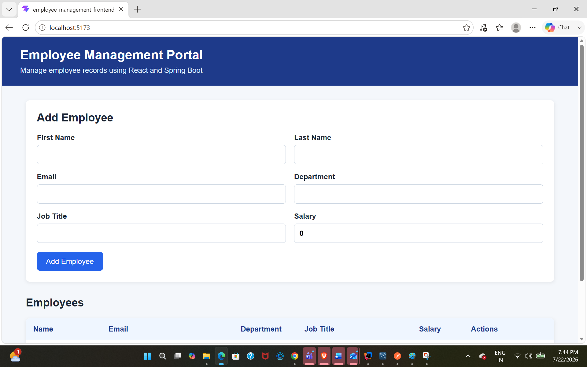
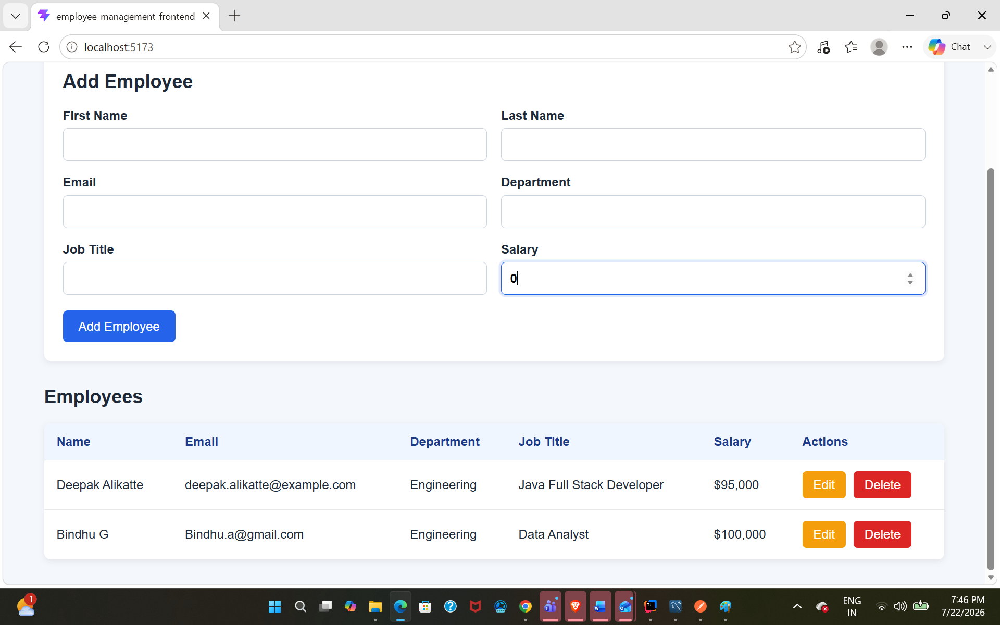

# Employee Management Portal

A full-stack employee management application built with Spring Boot, React, TypeScript, and MySQL. It provides a responsive interface for creating, viewing, updating, and deleting employee records.

## Application Preview

### Add Employee



### Manage Employees



## Features

- Create employee records
- View all employees
- Update employee information
- Delete employees with confirmation
- Validate employee information
- Prevent duplicate email addresses
- Display structured API error responses
- Persist employee data in MySQL
- Responsive React interface
- CORS configuration for frontend-backend communication
- Unit testing with JUnit 5 and Mockito
- Secure database-password configuration using an environment variable

## Technology Stack

### Backend

- Java 17
- Spring Boot
- Spring Web
- Spring Data JPA
- Hibernate
- Jakarta Validation
- Lombok
- Maven
- Embedded Tomcat
- JUnit 5
- Mockito

### Frontend

- React
- TypeScript
- Vite
- HTML5
- CSS3
- Fetch API
- ESLint

### Database

- MySQL 8

### Development Tools

- IntelliJ IDEA
- Postman
- MySQL Workbench
- Git
- GitHub

## Project Structure

```text
Java-Portfolio/
├── docs/
│   └── images/
│       ├── employee-form.png
│       └── employee-table.png
│
├── employee-management-backend/
│   ├── src/
│   │   ├── main/
│   │   │   ├── java/com/deepak/employeemanagement/
│   │   │   │   ├── config/
│   │   │   │   ├── controller/
│   │   │   │   ├── entity/
│   │   │   │   ├── exception/
│   │   │   │   ├── repository/
│   │   │   │   └── service/
│   │   │   └── resources/
│   │   │       └── application.properties
│   │   └── test/
│   │       └── java/com/deepak/employeemanagement/
│   │           └── service/
│   │               └── EmployeeServiceTest.java
│   └── pom.xml
│
├── employee-management-frontend/
│   ├── src/
│   │   ├── components/
│   │   ├── models/
│   │   ├── services/
│   │   ├── App.tsx
│   │   └── App.css
│   ├── package.json
│   └── package-lock.json
│
├── .gitignore
└── README.md
```

## Application Architecture

```text
React Frontend
      ↓ REST API
Spring Boot Controller
      ↓
Service Layer
      ↓
Spring Data JPA Repository
      ↓
MySQL Database
```

## REST API Endpoints

| Method | Endpoint | Description |
|---|---|---|
| POST | `/api/employees` | Create an employee |
| GET | `/api/employees` | Retrieve all employees |
| GET | `/api/employees/{id}` | Retrieve an employee by ID |
| PUT | `/api/employees/{id}` | Update an employee |
| DELETE | `/api/employees/{id}` | Delete an employee |

## Example Employee Request

```json
{
  "firstName": "Deepak",
  "lastName": "Alikatte",
  "email": "deepak@example.com",
  "department": "Engineering",
  "jobTitle": "Java Full Stack Developer",
  "salary": 85000.00
}
```

## Prerequisites

Install the following tools before running the application:

- Java 17
- Node.js
- npm
- MySQL 8
- Git
- IntelliJ IDEA or another IDE

## Database Setup

Create the MySQL database:

```sql
CREATE DATABASE employee_management_db;
```

The backend uses the following connection configuration:

```properties
spring.datasource.url=jdbc:mysql://localhost:3306/employee_management_db
spring.datasource.username=root
spring.datasource.password=${DB_PASSWORD}
```

Set `DB_PASSWORD` as a local environment variable containing your MySQL password.

Do not store database passwords directly in source code or commit them to GitHub.

## Running the Backend

Open a terminal inside:

```text
employee-management-backend
```

On Windows, run:

```powershell
.\mvnw.cmd spring-boot:run
```

The backend runs at:

```text
http://localhost:8080
```

The employee API is available at:

```text
http://localhost:8080/api/employees
```

## Running the Frontend

Open a separate terminal inside:

```text
employee-management-frontend
```

Install dependencies:

```powershell
npm install
```

Start the development server:

```powershell
npm run dev
```

The frontend normally runs at:

```text
http://localhost:5173
```

Use the exact URL displayed by Vite if port `5173` is already occupied.

## Testing

### Backend Unit Tests

The Service layer is tested using JUnit 5 and Mockito.

The tests cover:

- Creating an employee with a unique email
- Rejecting a duplicate email
- Retrieving an existing employee
- Handling an employee that does not exist
- Updating an employee
- Deleting an employee

Run the Service tests:

```powershell
.\mvnw.cmd -Dtest=EmployeeServiceTest test
```

Expected result:

```text
Tests run: 6, Failures: 0, Errors: 0
BUILD SUCCESS
```

### Frontend Code Quality

Run ESLint:

```powershell
npm run lint
```

Create a production build:

```powershell
npm run build
```

The optimized frontend output is generated inside:

```text
employee-management-frontend/dist
```

## Validation and Error Handling

The backend validates employee input using Jakarta Validation.

Examples include:

- First name is required
- Last name is required
- Email must be valid
- Email must be unique
- Salary must be greater than zero

The API returns structured responses for:

| Status | Meaning |
|---:|---|
| `400` | Validation failed |
| `404` | Employee not found |
| `409` | Duplicate email |
| `500` | Unexpected server error |

## Security

The MySQL password is externalized using:

```properties
spring.datasource.password=${DB_PASSWORD}
```

The real password remains in the developer’s local environment and is not stored in the repository.

The `.gitignore` excludes:

- Environment files
- IntelliJ run configurations
- `node_modules`
- Maven `target`
- Vite `dist`
- Logs and temporary files

## Future Enhancements

- Spring Security with JWT authentication
- Role-based access control
- Employee search and filtering
- Sorting and pagination
- Controller integration tests
- Frontend component tests
- Docker containerization
- CI/CD pipeline
- Cloud deployment

## Author

**Deepak Alikatte**

Full Stack Java Developer